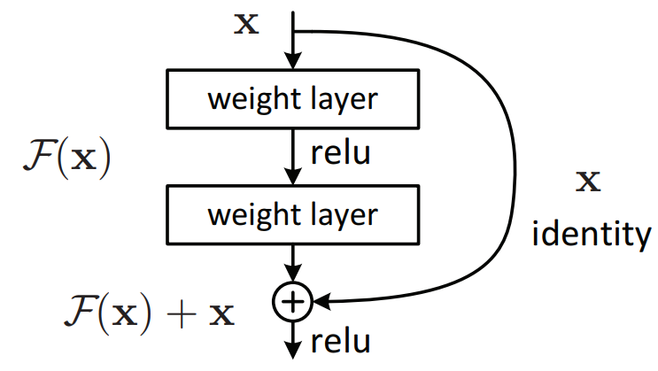
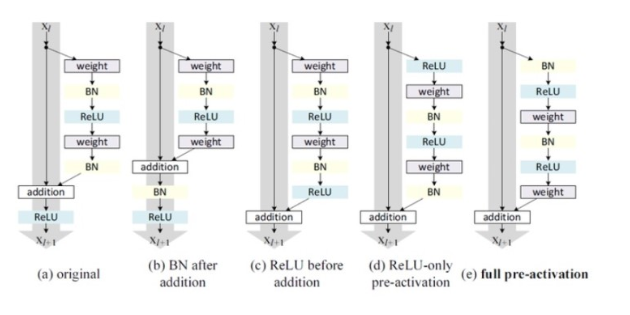
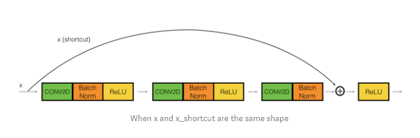
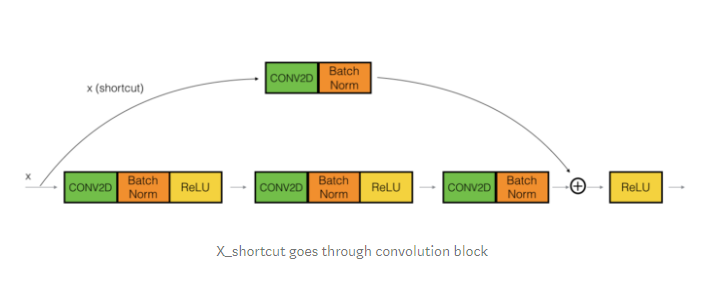
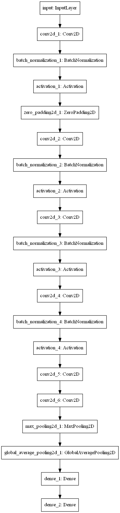

resnet은 그 이름에서 알 수 있듯이 residual에 대한 것입니다. 

일반적으로 신경망을 더 깊이 쌓으면 성능이 좋아지는 경향이 있기 때문에 많은 연구들에서는 더 깊은 신경망구조를 만드려고 노력했습니다. 이 과정에서 문제점은 경사소실 등의 문제로 모형이 잘 훈련되지 않는 다는 점입니다. 실제로 너무 깊은 망을 사용하는 경우 모형의 성능이 저하된다는 연구결과들이 있습니다. 이 점을 개선하고자 나온 방법이 resnet으로 residual block을 이용하는 것입니다.

residual block이란 gradient가 잘 흐르도록 길을 연결시켜주자는 생각입니다.  입력값을 바로 출력값에 연결시키자는 생각입니다. 그림을 보면 이해하기 쉬울 것입니다.



resnet은 F(x)가 0이 되도록 학습하게 되고 F(x) = H(x) - x 가 됩니다.

이 방법을 사용하여 실제로 성능이 향상되었다는 것을 알 수 있습니다.

다음 사진은 일반적인 모형과 resnet의 모형에 대해서 층의 수에 대한 비교입니다.



이렇게 성능이 개선되는 이유는 경사소실문제를 해결한다는 점 외에도 앙상블 모델을 구축한 것과 비슷한 효과를 낸다고 주장하였습니다. residual block을 만들면서 통로를 만들어 오고갈 수 있는 수가 늘어나기 때문입니다.


기본적인 개념은 이 정도로 정리할 수 있을 것 같습니다. 이 외에도 활성함수의 위치에 대한 비교 실험은 사진으로만 남기겠습니다.

! [resnet5] (images/resnet5.png)


실제로 모형을 구현할 때에는 두 가지 형태로 구현하게 될 것입니다.

첫 번째는 시작 시점과 더해지는 시점에서의 x의 크기(shape, dim)가 같은 경우입니다. 이 경우 지나가는 conv넷에서 처리를 해주기 때문에 x의 크기를 바꾸지 않습니다.



두 번째 경우는 두 값이 다른 경우입니다. convnet을 지나면서 padding등의 처리를 해주지 않으면 나오는 상황입니다. 이 경우 x의 크기를 잘 계산하여 convnet을 조절하여야 합니다.



첫 번째 경우의 간단한 예제 코드는 이렇게 만들어 볼 수 있을 것 같습니다.

```python
inputs = models.Input((224,224,3), name='input')

x = layers.Conv2D(64, (7, 7), strides=(2, 2))(inputs)
x = layers.BatchNormalization()(x)
x = layers.Activation('relu')(x)
x = layers.ZeroPadding2D(padding=(1,1))(x)

res = x

x = layers.Conv2D(filters=32, kernel_size=(1,1), padding='valid')(x)
x = layers.BatchNormalization()(x)
x = layers.Activation('relu')(x)

x = layers.Conv2D(filters=64, kernel_size=(3,3), padding='same')(x)
x = layers.BatchNormalization()(x)
x = layers.Activation('relu')(x)

x = layers.Conv2D(64, kernel_size=(1,1), padding='valid')(x)
x = layers.BatchNormalization()(x)

output = layers.Add()([x, res]) 

x = layers.Activation('relu')(x)

x = layers.Conv2D(64, kernel_size=(3,3), activation='relu')(x)
x = layers.Conv2D(64, kernel_size=(3,3), activation='relu')(x)
x = layers.MaxPooling2D(2)(x)

x = layers.GlobalAveragePooling2D()(x)

x = layers.Dense(units=128, activation='relu')(x)
out = layers.Dense(units=10, activation='softmax')(x)

model = keras.Model(inputs, out)
```



