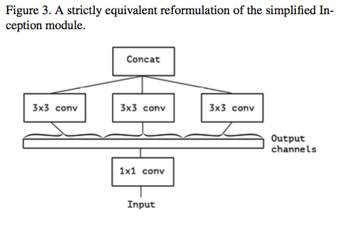

쉽게 이해하자면 여러 Conv layer가 각 입력 채널상에서 독립적으로 연산을 수행하는 것이다. 
입력의 공간적 위치는 상호 연관성이 높지만, 채널끼리는 상호 독립적이라고 가정하면 큰 의미를 지니게 된다.  

장점으로는 더 적은 양의 데이터를 사용해 더 나은 표현을 학습하는 경향이 있으므로 더 우수한 모형을 만들 수 있다.  

특히 제한된 상황에서 밑바닥부터 훈련할 때 중요하게 작용한다.  



이는 inception모듈과 결합해 xception모형을 만드는 근간이 되는 개념이다.

코드는 아래와 같이 형성할 수 있다.

```python
model = keras.models.Sequential()

model.add(layers.SeparableConv2D(filters=16, 
                                 kernel_size=3, 
                                 activation='relu',
                                input_shape = (size,size,channel)))
model.add(layers.SeparableConv2D(filters=16,
                                kernel_size=3,
                                activation='relu'))
model.add(layers.SeparableConv2D(filters=16,
                                kernel_size=3,
                                activation='relu'))
model.add(layers.SeparableConv2D(32, kernel_size=1, strides=2))

model.add(layers.SeparableConv2D(filters=16,
                                kernel_size=3,
                                activation='relu'))
model.add(layers.SeparableConv2D(filters=32,
                                kernel_size=3,
                                activation='relu'))
model.add(layers.SeparableConv2D(filters=16,
                                kernel_size=3,
                                activation='relu'))
model.add(layers.SeparableConv2D(32, kernel_size=1, strides=2))


model.add(layers.MaxPooling2D(2))
model.add(layers.GlobalMaxPooling2D())

model.add(layers.Dense(64, activation='relu'))
model.add(layers.Dense(classes, activation='softmax'))
```

