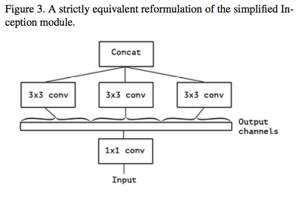
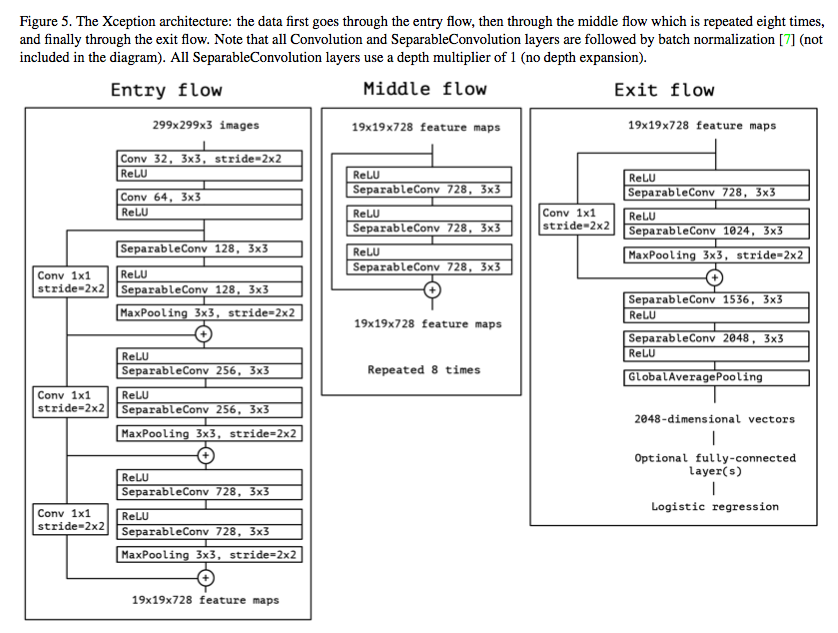

Xception에 대해 이야기 하기 전에 먼저 그 근간이 되는 separable Conv 층에 대해서 알아보겠습니다.

간단하게 설명하자면 여러 Conv layer가 각 입력 채널상에서 독립적으로 연산을 수행하는 것입니다. 
입력의 공간적 위치는 상호 연관성이 높지만, 채널끼리는 상호 독립적이라고 가정하면 큰 의미를 지니게 됩니다.  

장점으로는 더 적은 양의 데이터를 사용해 더 나은 표현을 학습하는 경향이 있으므로 더 우수한 모형을 만들 수 있습니다.  이를 바탕으로 발전한 것이 Xception 모형입니다.

특히 제한된 상황에서 밑바닥부터 훈련할 때 중요하게 작용한다.  



위 그림과 같은 층을 여러개 연결한 것이 Xception모형입니다. Xception모형은 공간적 특징들과 채널별 특징들이 완전히 분리되어 있습니다.  

Inception모듈과 비교할 때 비슷한 파라미터일 경우 더 효율적이라고 알려져있습니다. 

다른 한 가지 주목할 점은 중간에 activation function을 취하지 않는 다는 점인데 이는 실험을 통해 성능이 더 떨어진다고 확인하였기 때문이라고 합니다.

전체적인 모형은 아래와 같습니다. 



간단한 처리는 아래와 같이 구현해 볼 수 있습니다.

```python
model = keras.models.Sequential()

model.add(layers.SeparableConv2D(filters=16, 
                                 kernel_size=3, 
                                 activation='relu',
                                input_shape = (size,size,channel)))
model.add(layers.SeparableConv2D(filters=16,
                                kernel_size=3,
                                activation='relu'))
model.add(layers.SeparableConv2D(filters=16,
                                kernel_size=3,
                                activation='relu'))
model.add(layers.SeparableConv2D(32, kernel_size=1, strides=2))

model.add(layers.SeparableConv2D(filters=16,
                                kernel_size=3,
                                activation='relu'))
model.add(layers.SeparableConv2D(filters=32,
                                kernel_size=3,
                                activation='relu'))
model.add(layers.SeparableConv2D(filters=16,
                                kernel_size=3,
                                activation='relu'))
model.add(layers.SeparableConv2D(32, kernel_size=1, strides=2))


model.add(layers.MaxPooling2D(2))
model.add(layers.GlobalMaxPooling2D())

model.add(layers.Dense(64, activation='relu'))
model.add(layers.Dense(classes, activation='softmax'))
```

