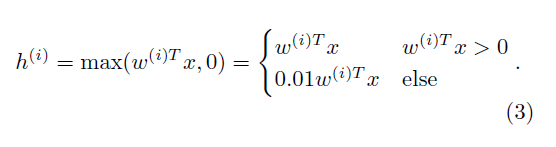
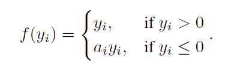
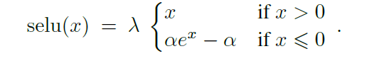
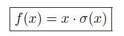
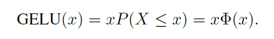
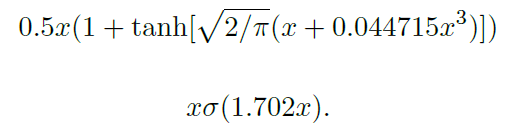

# Several Activation

-   최근 논문을 읽다가 생소한 activation 함수들이 나와서 최근 나온 논문을 정리해 봄
-   나온 연도 순으로 정리
-   GELU, SWISH, MISH를 제외한 activation은 tf/keras/torch에 구현되어 있음
    -   해당 activation들도 간단하여 바로 작업가능
    -   codes에 example(.ipynb)과 함수/객체(.py) 저장
        -   torch는 입문이라 코드가 깔끔하지 않음

## LReLU(2013)

-   Leaky ReLU로 알려진 함수
-   음의 값일 때 0인것을 어느정도 보강시켜 줌(non-zero gradient)
-   논문에서는 0.01정도로 작은 값을 사용함(개인적으로는 0.1~0.3을 사용해왔음..)
-   논문에서는 ReLU와 비교하여 성능향상은 없지만 수렴속도는 더 빨라졌다고 함
    -   classic activation(tanh, sigm)와 비교해서는 향상
    -   상황에 따라 다를 수 있음

## PReLU(2015)

-   정리를 하기 전 알고 있던 가장 최신 버전
-   Leaky ReLU에서 일정 값을 곱해주던 것을 parameterized
-   ReLU보다 성능 향상을 보였음
    -   특정 initializing method와 함께 사용하면 더 좋음

## SELU(2017)

-   가장 인상적이었던 논문
-   CNN/RNN에 비해 FNN에서는 발전이 많이 없던 점을 지적하며 고안
-   구조상 절대로 발산하지 않는다고 함
-   lecum normal initialization / alpha dropout과 함께 사용
-   적용 사례가 많지는 않아 실제로 확인해 보면 좋을 듯

## SWISH(2017)

-   x * sigm(x)

-   구글 브레인에서 발표한 ReLU를 대신할 activation
    -   그래서 출시와 동시에 tf에 구현이 되어있다고 함
-   non-monotonic, smoothness, one-sided boundness가 핵심이라고 함
-   실험에서 ReLU보다는 나은 점을 보여주지만 다른 activation들과는 아직 경쟁이 필요할 듯
    -   data analysis에는 왕도가 없다..

## GELU(2018)

-   stochastical하게 dropout을 구현하는 느낌
    -   해당 확률은 cdf of gaussian(x)
    -   위 확률은 BN과 함께 사용시 대부분 normal한 값들을 갖는다는 것에서 착안
-   noise에 대해서 robust한 성능을 보여줌
-   ReLU, ELU의 smooth버전이라고 볼 수도 있음
-   momentum optimzier와 함께 사용하기를 권장

## MISH(2019)

-   f(x) = x * tanh(softplus(x))

-   정리를 하게 된 계기가된 activation
-   yolov4논문에서 확인하였으며 19년 하반기에 나온 논문으로 가장 최신
-   SWISH와 상당히 유사한 성격을 가짐(논문 형식도)
-   구현하기는 매우 쉬우며 실험해볼 필요가 있음

## Reference

[1] LReLU (Rectifier Nonlinearities Improve Neural Network Acoustic Models)

[2] PReLU (Delving Deep into Rectifiers Surpassing Human-Level Performance on ImageNet Classification)

[3] SeLU (Self-Normalizing Neural Networks)

[4] GeLU (GAUSSIAN ERROR LINEAR UNITS (GELUS))

[5] Swish (SWISH: A SELF-GATED ACTIVATION FUNCTION)

[6] Mish (Mish: A Self Regularized Non-Monotonic Neural Activation Function)
